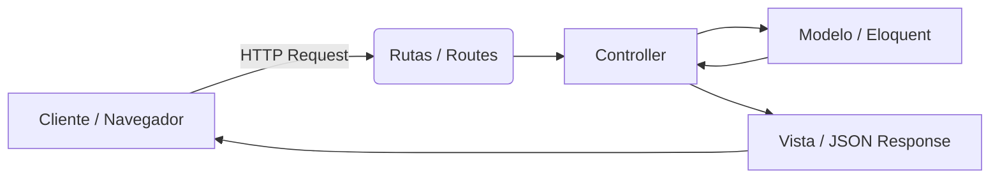

## **¿Que Son Los Controllers?**

Son las clases que se encargan de **Manejar la logica de las rutas** la la aplicacion. Parte fundamental del patron MVC (Model-View-Controller).

**1️⃣¿Que Es Un Controller En Laravel?**

 -  Es una **clase PHP** que normalmente se ubica en`app/Http/Controllers`.
    
-   Su función principal es **recibir peticiones HTTP**, procesarlas (posiblemente interactuando con modelos) y **devolver una respuesta** (HTML, JSON, redirección, etc.).
    
-   Cada controller puede tener varios **métodos**, que representan acciones o endpoints de la aplicación.

**2️⃣ Responsabilidades de un controller**

-   **Recibir y validar peticiones**
    
    -   Maneja la información que viene de formularios, JSON, query params, etc.
        
    -   Ejemplo: `$request->validate([...])`.
        
-   **Coordinar la lógica de negocio**
    
    -   Llama a **modelos** para consultar, crear, actualizar o eliminar datos.
        
    -   Puede llamar a servicios externos o a helpers.
        
-   **Devolver respuestas**
    
    -   JSON para APIs (`response()->json(...)`)
        
    -   Vistas para aplicaciones web (`return view('users.index')`)
        
    -   Redirecciones (`return redirect()->route('home')`)
        
-   **Aplicar middleware (opcional)**
    
    -   Por ejemplo, `auth` para proteger rutas, `throttle` para limitar peticiones.