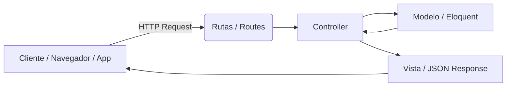

# Models en Laravel



Los **models** son clases que representan **las tablas de la base de datos** y se encargan de **interactuar con ellas**, siendo parte de la capa **Model** en el patrón MVC.

## Qué es un model

- Es una **clase PHP** que normalmente se encuentra en `app/Models`.
- Cada model suele **representar una tabla** en la base de datos.
- Usando **Eloquent ORM**, los models permiten:
  - Consultar datos
  - Crear, actualizar y eliminar registros
  - Definir relaciones entre tablas
  - Agregar lógica de negocio específica de la entidad

**Ejemplo de model básico:**

```php
namespace App\Models;

use Illuminate\Database\Eloquent\Model;

class User extends Model
{
    protected $fillable = ['name', 'email', 'password'];
}
```

## Responsabilidades de un model

### 1. Interactuar con la base de datos

```php
$users = User::all();       // Obtener todos los usuarios
$user = User::find(1);      // Obtener usuario con id 1
```

**Crear registros:**

```php
User::create([
    'name' => 'Juan',
    'email' => 'juan@mail.com',
    'password' => bcrypt('123456')
]);
```

### 2. Definir relaciones

- Uno a muchos, muchos a muchos, uno a uno, etc.

```php
class Post extends Model
{
    public function user() {
        return $this->belongsTo(User::class);
    }
}
```

### 3. Agregar lógica de negocio

- Métodos que calculan valores, validan datos o transforman atributos.

```php
public function fullName()
{
    return $this->first_name . ' ' . $this->last_name;
}
```

### 4. Controlar cómo se guardan y muestran los datos

| Atributo   | Función |
|-----------|---------|
| `$fillable` | Campos permitidos para asignación masiva |
| `$guarded`  | Campos protegidos frente a asignación masiva |
| `$hidden`   | Oculta campos al serializar a JSON (ej. password) |
| `$casts`    | Convierte automáticamente tipos de datos (ej. fechas, booleanos) |