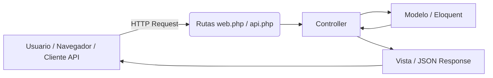

# Rutas en Laravel: Carpeta `routes`

En Laravel, la carpeta `routes` contiene **todos los archivos que definen las rutas de tu aplicación**, es decir, las URLs que los usuarios pueden visitar y cómo deben ser manejadas por el sistema.

## Archivos principales

### 1️⃣ `web.php`

* Rutas que responden a solicitudes web.
* Devuelven **vistas HTML**.
* Usan sesiones, cookies y protección CSRF.

```php
Route::get('/', function () {
    return view('welcome');
});

Route::get('/dashboard', [DashboardController::class, 'index'])->middleware('auth');
```

### 2️⃣ `api.php`

* Rutas para **API**.
* Devuelven **JSON**.
* No usan sesión ni cookies por defecto.
* Prefijadas con `/api`.

```php
Route::get('/users', [UserController::class, 'index']);
Route::post('/login', [AuthController::class, 'login']);
```

### 3️⃣ `console.php`

* Define comandos **de Artisan** personalizados.
* No define rutas HTTP.

```php
Artisan::command('informe:usuarios', function () {
    $this->info('Informe generado!');
});
```

### 4️⃣ `channels.php`

* Configura **canales de notificaciones** para broadcasting.
* Permite definir canales privados, públicos o personalizados.

```php
Broadcast::channel('orders.{orderId}', function ($user, $orderId) {
    return $user->id === Order::findOrNew($orderId)->user_id;
});
```

## Resumen en tabla

| Archivo        | Uso principal                            | Respuesta típica |
| -------------- | ---------------------------------------- | ---------------- |
| `web.php`      | Rutas web con sesiones y CSRF            | HTML / Blade     |
| `api.php`      | Rutas API sin sesiones                   | JSON             |
| `console.php`  | Comandos de consola Artisan              | Terminal         |
| `channels.php` | Canales de notificaciones / broadcasting | N/A              |

## Diagrama de flujo (MVC)


